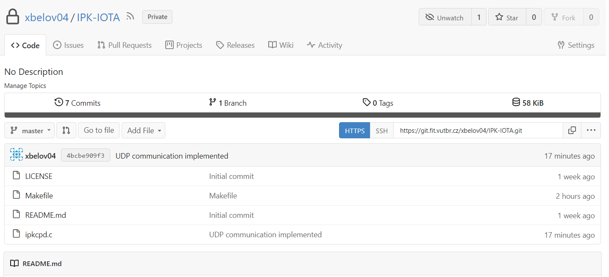
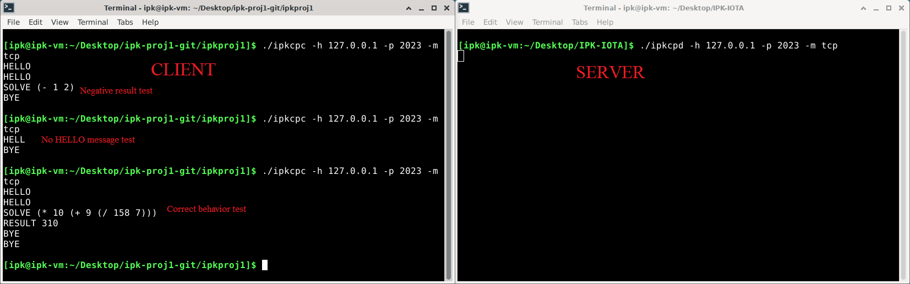
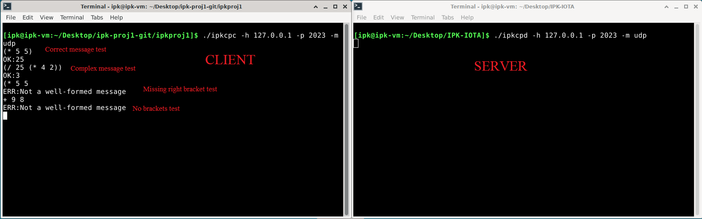

# IPK Calculator Protocol Server

The program is used for client/server communication and represents the server side of the communication , it uses the IPK Calculator Protocol [1] for communication with the clients.

  

## Usage

  

To build the program, run the ***make*** command in your **Unix** command line while inside the main directory.

  

The usage is:

>  *./ipkcpd -h \<host\> -p \<port\> -m \<mode\>*

  

The arguments may follow in any order but all arguments must be filled out, otherwise the program responds with an error message.

  

The ***host*** is the address of the server and the ***port*** is where the server is communicating with clients.

  

There are only two selectable ***modes*** for the program:

  

- **tcp** (textual)

- **udp** (binary)

  

Every different mode argument will be followed with an error message.

The program can be terminated by pressing the **Ctrl-C** combination.

## Detailed description

The program reads through the arguments and checks, if all have been filled out. Determines what is the server address and port, and what mode will be used.

Based on the selected mode, the program either uses a **SOCK_STREAM (TCP)** socket or a **SOCK_DGRAM (UDP)** socket.

### TCP

First the program **binds** the socket to the server address and starts **listening** for incoming connections.

The program uses the **poll.h** library and its functions to simultaneously communicate with multiple clients. The clients and their addresses are stored in an array.

With a loop and the **poll()** call, the program checks for new events on the file descriptors. An even on the listening socket is a new incoming connection and on the rest of the field is an incoming message.

The program reads the message and determines if it was sent in a correct format and responds. To messages in wrong order (not sending an **"HELLO"** message first) or in a incorrect format, the server responds by sending a **"BYE"** message and removing the respective file descriptor from the array.

To correct messages the server responds by sending back the result.

### UDP

The program **binds** the socket to the server address and is waiting for an incoming message.

When a message arrives, the program checks if it is in the correct format. To correct messages, the server responds by sending back the computed result. To incorrect messages, the server instead responds by sending an error message, informing the client of the incorrect format of the request.

## Multiplatform compatibility

The compatibility between **Unix** and **Windows** systems is secured by using **#ifdef** macros, where the program decides which libraries to include for which platform. However there isn't a corresponding **Windows** library to the **Unix** based **poll.h** library.

## Gitea snapshot

The snapshot of the used Gitea repository:

## Testing

### TCP tests

  

Basic functionality test:

  

  

### UDP tests

  

Basic functionality test:

  

  
 ## Extra functionality
 
  The following are implemented:
  - option "\-\-help" which prints out the correct usage of the program
  - arguments can be in any order

## References

[1] https://git.fit.vutbr.cz/NESFIT/IPK-Projekty/src/branch/master/Project%201/Protocol.md